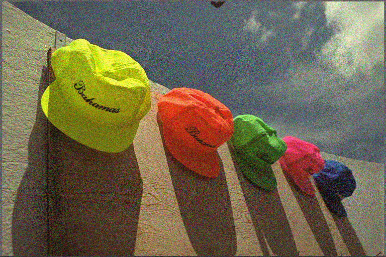
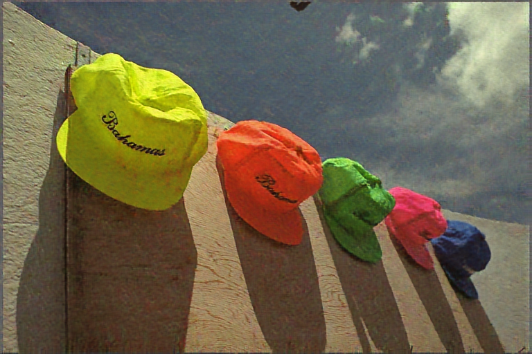
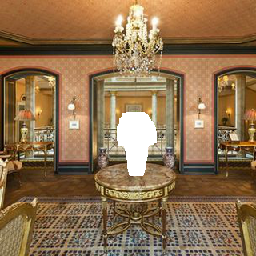
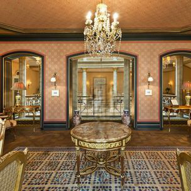

# Super-resolution
You can run the code of super-resolution as follows.
```
python super_resolution.py <LR_image_name> <SR_image_name>
```
This is an example of the result. From left to right, LR, bicubic and the proposed method.

  
<br>
<br>


# Denoising
You can run the code of denoising as follows.
```
python denoising.py <noisy_image_name> <denoised_image_name>
```
This is an example of the result. A noisy image and the denoised image.

 
<br>
<br>
  
  
# Inpainting
You can run the code of inpainting as follows.
```
python inpainting.py <masked_image_name> <mask_image_name> <inpainted_image_name> 
```
This is an example of the result. A masked image and the inpainted image.

 
